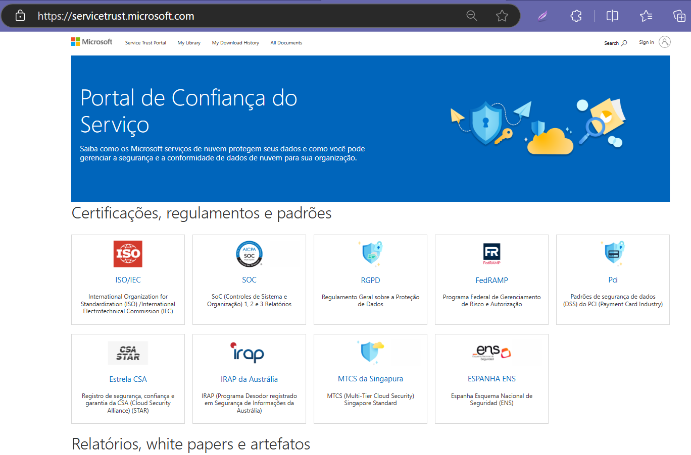
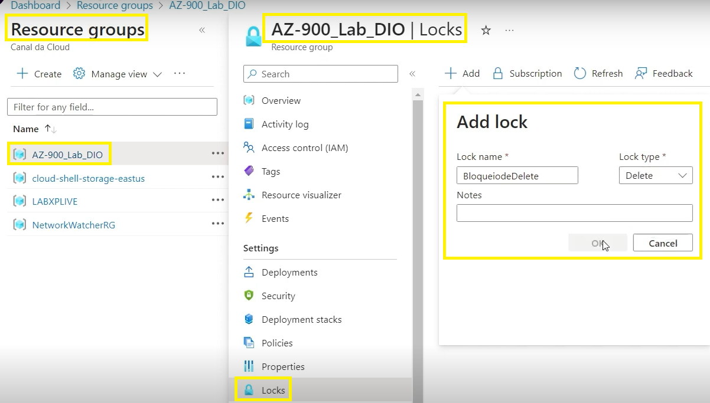
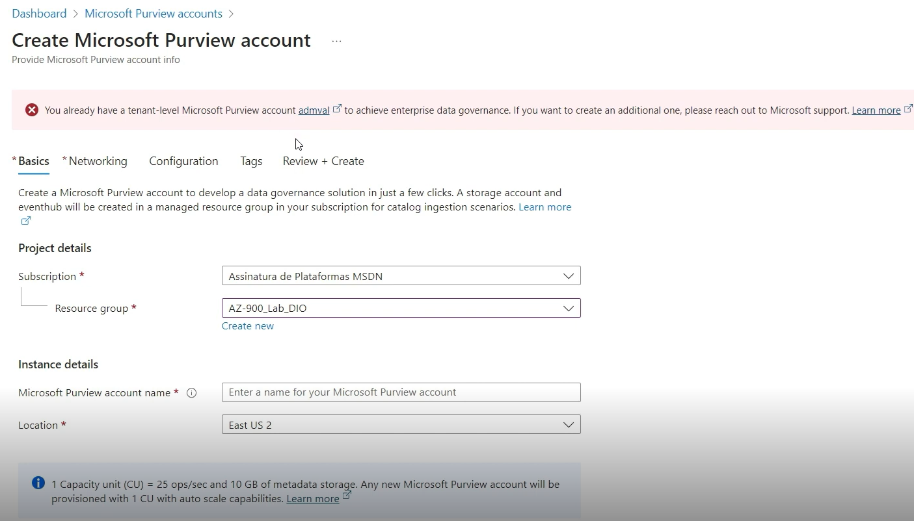
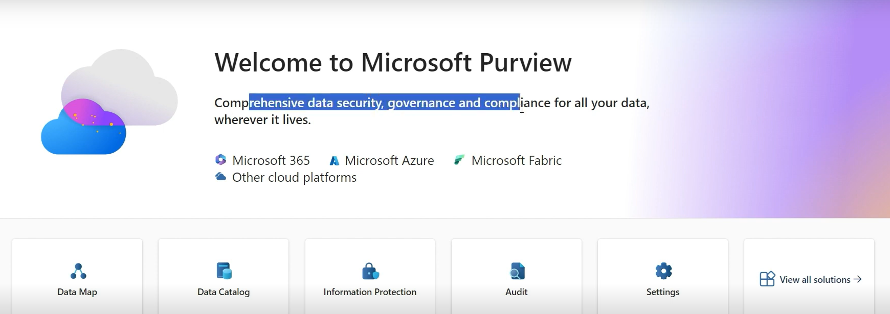
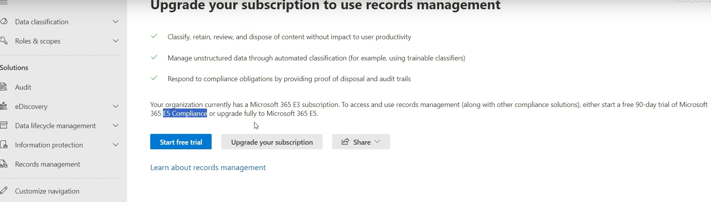
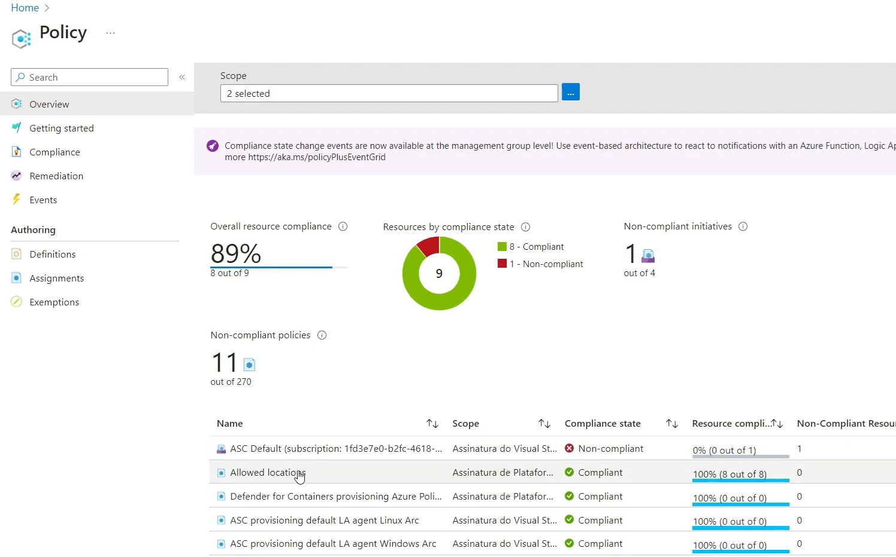
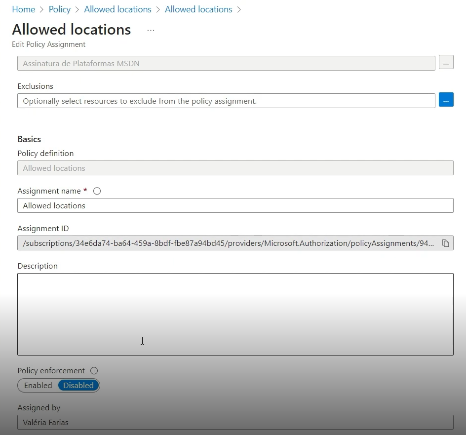
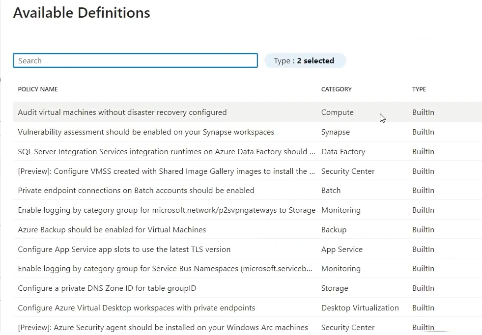

# ☁️ GERENCIANDO POLÍTICAS EM ACESSOS AZURE
 

  

---  
## ⏯️ INTRODUÇÃO  

Neste laboratório do bootcamp <i>Azure Essencials</i>, foram abordadas questões referentes ao gerenciamento de políticas em acessos no portal <a href='https://portal.azure.com/'><i>Microsoft Azure</i></a>. Através do projeto, foram exploradas o Portal de Confiança do Serviço, bloqueios, portal Purview e as políticas. 
     

--- 
## 🗒️RESUMO DOS TÓPICOS:  

- No Portal de Confiança do Serviço encontra-se documentação de regulamentos e certificações apresentados pela Microsoft em auditorias. Por ex., em Recursos Regionais e do Setor, para serviços financeiros, estão os recursos que elaboram diretrizes de conformidade regulatória para FSI (por país).
    

   

  

- OBSERVAÇÃO: FSI é a sigla de Serviços Financeiros e, no cenário da regulamentação, refere-se a qualquer atividade que inclui intermediação de recursos financeiros (bancos, seguradoras, corretoras, instituições de pagamento etc.).
   

- Na consulta detalhada de recurso, pode ser visto o bloqueio existente e o seu escopo (o grupo de recursos que foi bloqueado para determinada ação). Para fazer qualquer alteração será necessário modificar o escopo pai.
      

  
  

  

- Por exemplo, uma tentativa de usar DELETE para excluir uma rede virtual no Azure gera aviso de que o recurso está bloqueado, desde que este recurso tenha herdado o bloqueio do seu grupo de recursos. Se o bloqueio fosse SOMENTE LEITURA, a alteração para apagar seria impossível.
  

- O recurso Purview, apesar de aparentemente disponível, precisa ser criado (criar conta de usuário, usando review + create) e administrado. Com a conta criada, deve-se clicar no nome do usuário para acessar o portal do Purview.
     

  

  

- O portal do Purview oferece segurança, governança e compliance aos dados, provenientes do Microsoft 365, Azure, Microsoft Fabric e outras plataformas de nuvem. Oferece soluções de: plataforma, risco e compliance, governança de dados, segurança de dados, privacidade e recursos.
    

   

  

- Por exemplo, o recurso de gerenciamento de gravações e outras soluções de compliance são liberados conforme o tipo de assinatura do Azure, na versão experimental para assinante de Microsoft 365 E 5 Compliance em teste por 90 dias  ou upgrade completo para Microsoft 365 E 5.
   

   

    

- A solução de privacidade Microsoft Priva ajuda em questões regulatórias, trabalha em parceria com o Purview (faz compliance). É aplicável na adequação de uma empresa à LGPD no Brasil, indicando onde falta enquadramento. 
  

- IMPORTANTE! Purview não é uma ferramenta de segurança porque não avisa sobre ocorrências, apenas analisa e entrega relatório da situação.
 

   

 

- As políticas são formas de padronização. As regiões permitidas definem as políticas e são apenas 6 (Brazil, Brazil South, Brasil Southeast, Brazil US, East US, East US 2). Existe possíbilidade de criar políticas personalizadas utilizando como templates alguma política próxima da necessidade do interessado. 
 

- Caso a política seja criada já tendo recursos em qualquer outro lugar, não se terá 100% de compliance, havendo desatendimento, por manter a política criada sem possibilidade de alterar política já existente. 
 

  

- Ao criar uma política no Azure, por padrão, já está selecionada a opção habilitada. Sendo uma situação de teste ou momento inadequado para aplicar a política, pode ser selecinada a opção desabilitada. 
   

  
 

  

- A política é aplicada para gestão e padronização de recursos, independe do tipo de permissão de quem tenta manusear os recursos. 
  

---    
## ✍️ AUTORA    

Carla Edila Silveira  
Contato: rosa.carla@pucpr.edu.br  

---  
## ©️ LICENÇA

[MIT](https://choosealicense.com/licenses/mit/)  

---  
## 🔗 LINKS ÚTEIS  

- [Portal de Confiança do Serviço](https://servicetrust.microsoft.com/)
- [Bloquear seus recursos para proteger sua infraestrutura](https://learn.microsoft.com/pt-br/azure/azure-resource-manager/management/lock-resources?tabs=json)
- [Saiba mais sobre o Microsoft Purview](https://learn.microsoft.com/pt-br/purview/purview)
- [Documentação do Azure Policy](https://learn.microsoft.com/pt-br/azure/governance/policy/)
  
---
