# ☁️ OTIMIZANDO CUSTOS NO AZURE
 

  

---  
## ⏯️ INTRODUÇÃO  

Neste laboratório do bootcamp <i>Azure Essencials</i>, foram abordadas questões referentes à otimização de custos no portal <a href='https://portal.azure.com/'><i>Microsoft Azure</i></a>. Através do projeto, foram exploradas as calculadoras (TCO, de Preços) e as tags. 
     

  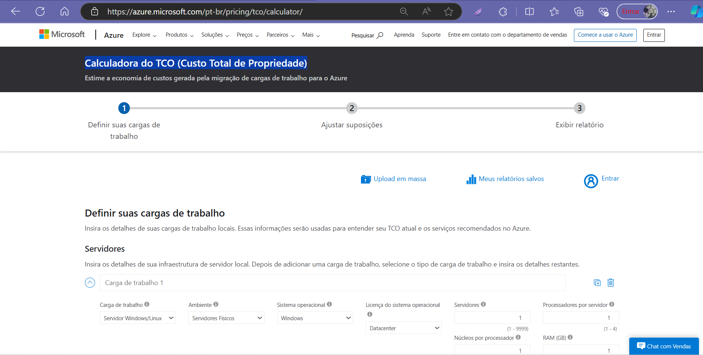 

--- 
## 🗒️RESUMO DOS TÓPICOS:  

- Antes de fazer a migração de cargas de trabalho para o Azure, é importante estimar os custo dessa mudança para o ambiente de cloud.
     

  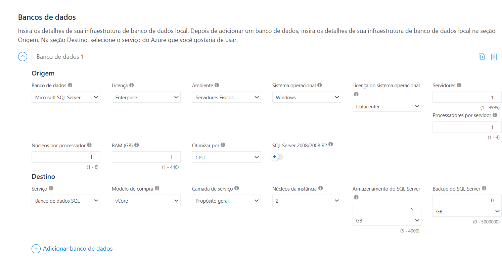
  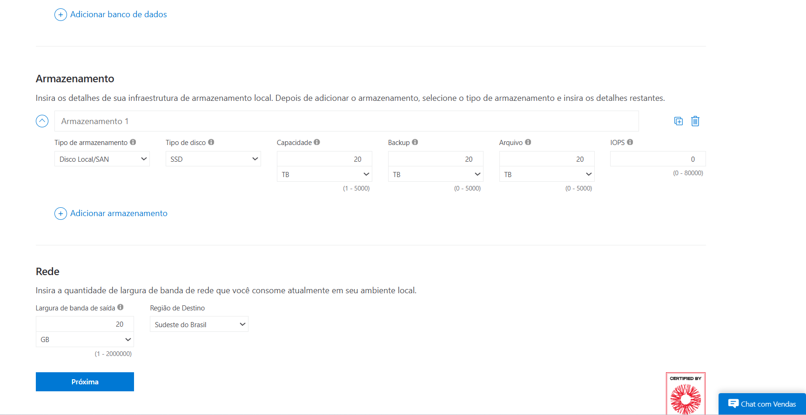

- Para isso, é disponibilizada a calculadora do TCO (Custo Total de Propriedade), onde são definidas as cargas de trabalho, ajustadas as suposições e exibido o relatório, sendo estimadas as cargas para uso de servidores, banco de dados, armazenamento e rede.
 

   

- Na etapa Ajuste de Suposições, podem ser ajustadas configurações, como ativar o Benefício Híbrido do Azure em cobertura de software (Windows e SQL Server locais) para levar licenças que o cliente já tem, assim pode receber desconto no preço estimado.
      

  
  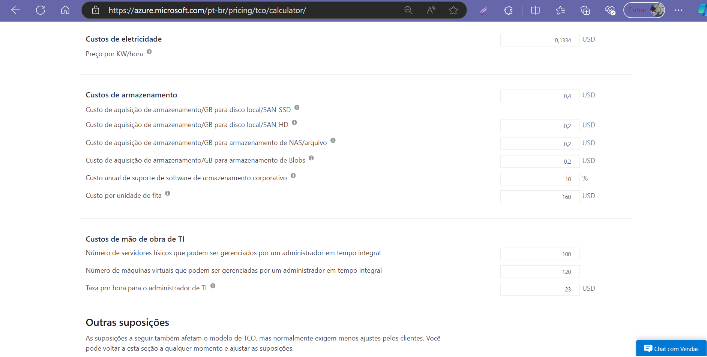

- O relatório exibe o valor em dólares da estimativa de economia com a migração para o Azure, gráficos comparativos de custos locais e no Azure. Pode ser usado como ferramenta de apoio para convencer um cliente que a migração para a nuvem é a melhor estratégia, considerando o camparativo de custos e a economia estimada.
    

 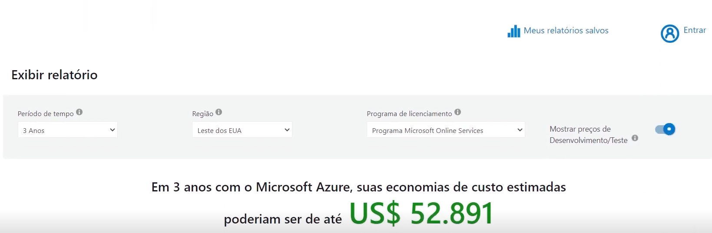

- A calculadora oficial de preços do Azure, ao ser acessada, mostra uma mensagem para fazer login que é um acesso fechado e privilegiado para empresas grandes, que têm contrato diretamente com a Microsoft, passando a usufruir de benefícios concedidos pelo modelo de contrato, como descontos em serviços e consultas especiais no portal.
     

  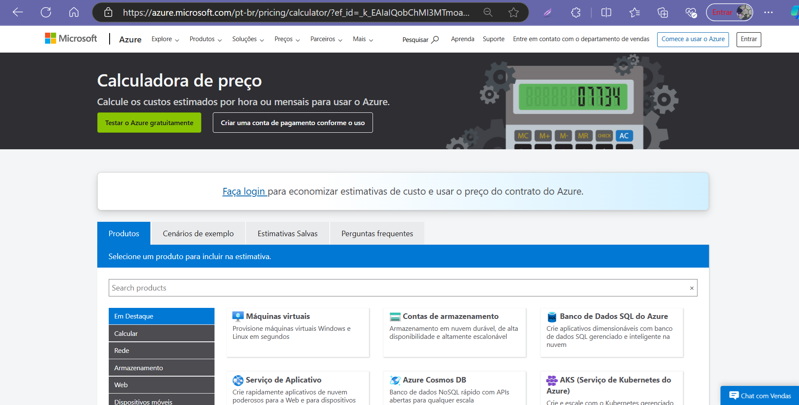

- No cálculo do custo de uma VM há diferenças significativas entre o preço original (mantendo as configurações sugeridas no portal), preço com Benefício Híbrido do Azure e o preço com o mesmo Benefício com reserva por 3 anos.
    

  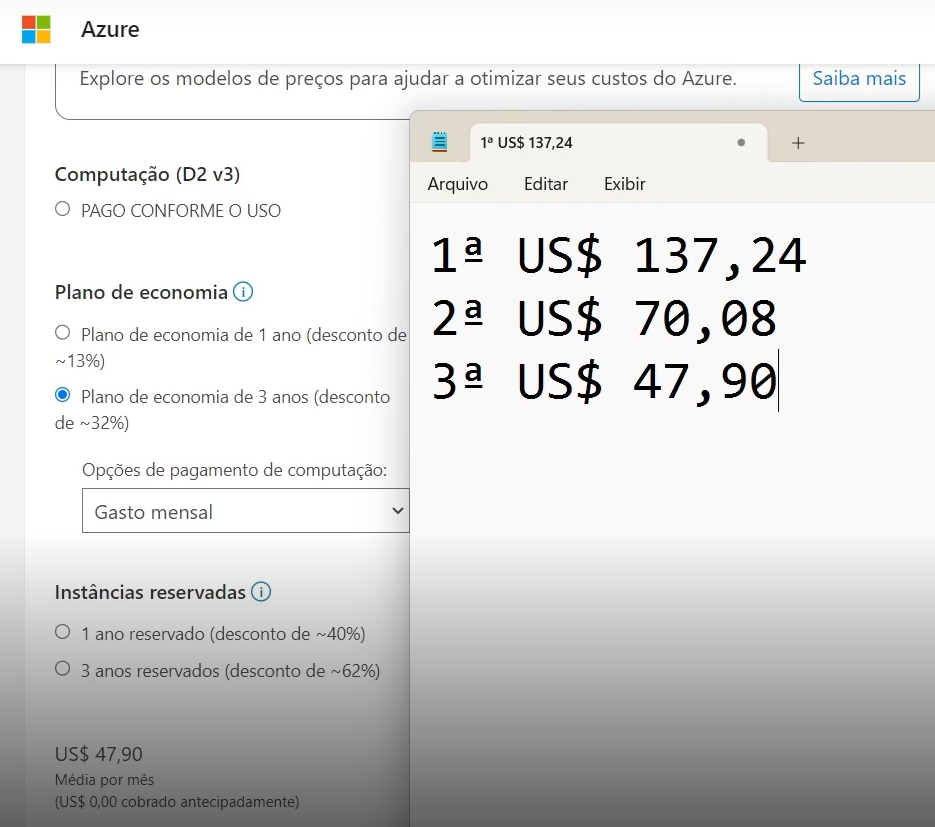 

- No cálculo de VM ligada por 12 horas em 26 dias do mês, o preço mensal cairia para US$ 29,95. O ideal é calcular o preço de todo o ambiente de nuvem pretendido, não somente de um dos recursos.
    

   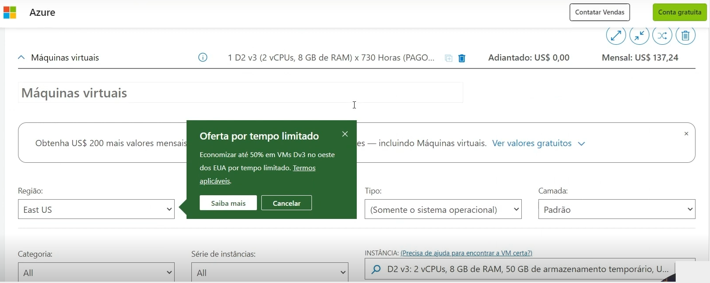
  

- Com o Cost Management + Billing, pode se obter uma visão geral do ambiente e se há alerta de custo, um orçamento pré-determinado, também faz recomendações do advisor para sugerir melhorias relacionadas a custo. 
    

 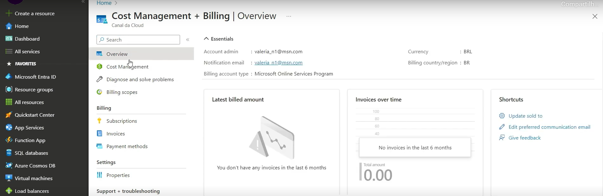  

    

- A funcionalidade TAG pode ser atribuída opcionalmente a um grupo de recursos, mas não é herdada pelos recursos dentro do grupo. 
 

 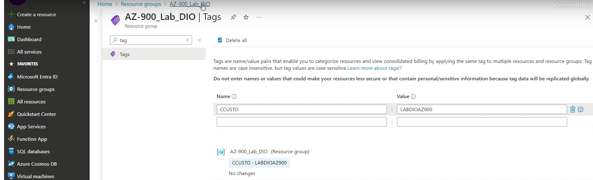  

 

- Em Policy, pode ser criada uma condição para que só seja criado um recurso se tiver uma tag.
 

  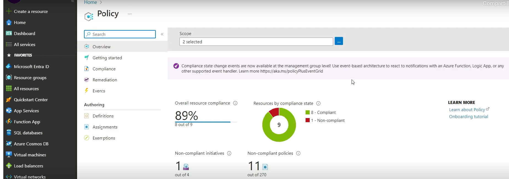

---    
## ✍️ AUTORA    

Carla Edila Silveira  
Contato: rosa.carla@pucpr.edu.br  

---  
## ©️ LICENÇA

[MIT](https://choosealicense.com/licenses/mit/)  

---  
## 🔗 LINKS ÚTEIS  

- [Calculadora do TCO (Custo Total de Propriedade)](https://azure.microsoft.com/pt-br/pricing/tco/calculator/)
- [Calculadora de preço](https://azure.microsoft.com/pt-br/pricing/calculator/?ef_id=_k_EAIaIQobChMI3MTmoaT4iAMVIVZIAB1qnSF0EAAYASAAEgLgiPD_BwE_k_&OCID=AIDcmmzmnb0182_SEM__k_EAIaIQobChMI3MTmoaT4iAMVIVZIAB1qnSF0EAAYASAAEgLgiPD_BwE_k_&gad_source=1&gclid=EAIaIQobChMI3MTmoaT4iAMVIVZIAB1qnSF0EAAYASAAEgLgiPD_BwE)
- [Use marcas para organizar os recursos do Azure e a hierarquia de gerenciamento](https://learn.microsoft.com/pt-br/azure/azure-resource-manager/management/tag-resources)
  
---
